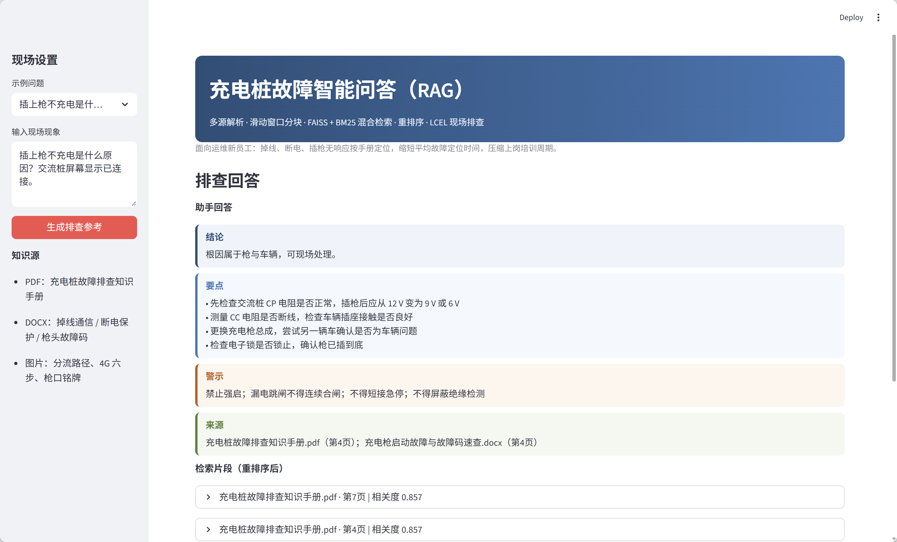

# ChargeRAG · 充电桩故障智能问答

充电桩掉线、断电、插枪无响应后，往常靠老师傅经验，定位慢、新员工上手慢。本项目用 **RAG**：先检索现场手册，再生成可执行步骤，缩短平均定位时间，压缩培训周期。

语言：**Python**

---

## 技术关键词

`RAG` · `LangChain LCEL` · `FAISS` · `BM25` · `RRF` · `gte-rerank` · `Qwen-Turbo` · `DashScope` · `滑动窗口分块` · `索引热加载` · `Streamlit`

| 层 | 选型 |
| --- | --- |
| 编排 | LangChain LCEL，检索结果注入提示词 |
| 向量 | DashScope `text-embedding-v1` + FAISS `IndexFlatIP` |
| 关键词 | BM25（汉字 + 拉丁词） |
| 融合 / 重排 | RRF（k=60）→ `gte-rerank` Top-6 |
| 生成 | `qwen-turbo`，只根据手册作答 |
| 界面 | Streamlit |

---

## 解决方案

纯大模型容易「直接合闸、掉线就换功率模块」。这里只根据手册回答：

1. **解析**：PDF 手册、DOCX 故障码表、分流 / 4G / 枪口示意图  
2. **分块**：滑动窗口 500 / 80，在句号、分号、换行处切断  
3. **检索**：FAISS 语义 + BM25 专名 → RRF → 重排序；索引落盘，提问时热加载  
4. **生成**：【结论】【要点】【警示】【来源】；资料不足则升级二线  
5. **评测**：同一问题对比 RAG 与纯模型，看手册关键词覆盖和高风险说法是否被压住

---

## 系统架构

离线建库，在线只热加载，不对整本手册重新向量化。



---

## 模块逻辑

主代码：`RAG-yym/src/charge_rag.py`

| 模块 | 做什么 |
| --- | --- |
| `load_pdf/docx/image` | 抽文本；DOCX 表格转 Markdown；图片写成说明 |
| `sliding_window_split` | 500 字窗口、80 字重叠，保护故障码表和排查时序 |
| `ChargeIndex` | FAISS + BM25 一起存；有索引则 `load()`，`--force` 才重建 |
| `hybrid_retrieve` | 两路 Top-20 → RRF → `gte-rerank` Top-6 |
| `build_chain` | LCEL：检索 → 注入上下文 → Qwen |
| `app.py` | 输入现场现象，展示四段卡片和证据原文 |

```
问题 ─┬─ Embedding → FAISS Top-20
      └─ tokenize  → BM25 Top-20
              ↓ RRF → gte-rerank Top-6
              ↓ LCEL + Qwen
         【结论】【要点】【警示】【来源】
```

向量找近义（掉线 ↔ 心跳超时），BM25 打专名（E021、APN、RCD）。

---

## 运行结果

`streamlit run app.py` 后提问：「充电桩掉线了怎么查？平台显示离线，屏幕还能操作。」



判定为通信故障、可现场处理：先分单桩/整站，再看 4G 灯与 SIM，核对 APN，用热点验证。禁止直接合闸，不要一上来换功率模块。证据来自掉线手册和排查手册对应页。

---

## 快速开始

```bash
cd RAG-yym
python -m venv venv
venv\Scripts\activate
pip install -e . -r requirements.txt
```

将 `env` 复制为 `.env`，填入 `DASHSCOPE_API_KEY`。

```bash
python build_charge_index.py     # 已有索引则热加载
streamlit run app.py             # http://localhost:8501
python evaluate_charge_rag.py
```

| 目录 | 作用 |
| --- | --- |
| [RAG-yym](./RAG-yym) | 主工程：混合检索、LCEL、评测、Web |
| [CASE-ChatPDF-Faiss](./CASE-ChatPDF-Faiss) | 手册 ChatPDF，回答带页码 |
| [CASE-RAG助手](./CASE-RAG助手) | DOCX + 示意图多模态检索 |
